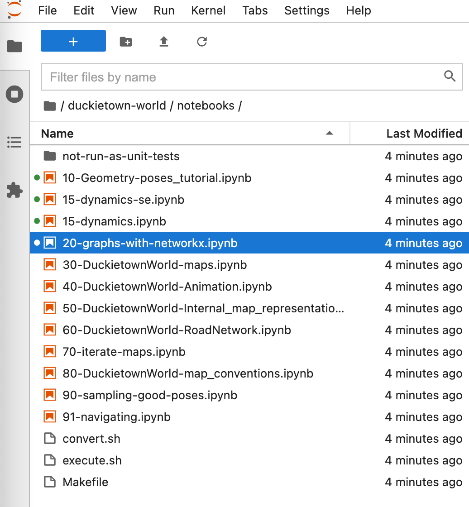

- [Exercise: Write a path planner](#exercise--write-a-path-planner)
  * [Path planning problems](#path-planning-problems)
    + [No obstacles](#no-obstacles)
    + [Static obstacles](#static-obstacles)
    + [Dynamic obstacles](#dynamic-obstacles)
  * [Instructions](#instructions)
    + [Passing criteria](#passing-criteria)
  * [Data structures and protocol](#data-structures-and-protocol)
    + [Extension: moving obstacles](#extension--moving-obstacles)
  * [Visualization](#visualization)
  * [Challenge scoring criteria](#challenge-scoring-criteria)
  * [Tips for implementing the planners](#tips-for-implementing-the-planners)
    + [Start with the empty obstacles challenge](#start-with-the-empty-obstacles-challenge)
    + [Continue with the static obstacles case](#continue-with-the-static-obstacles-case)
    + [Try the dynamic case](#try-the-dynamic-case)
    + [Finally, the bounded curvature case](#finally--the-bounded-curvature-case)
- [Activity: Go through the duckietown-world notebook sequence](#activity--go-through-the-duckietown-world-notebook-sequence)

# Exercise: Write a path planner

In this series of exercises, you will write path planners of increasing complexity. 

You need to have solved the `collision` exercise, because you will need a collision checker. 

Note: This is a code-only exercise: you don't need the Duckiebot.
 
## Path planning problems

We will consider several variations of path planning problems.

There are **two complexity axes**: dynamic constraints and environment complexity.


For **dynamic constraints** we have 2 cases:

1. The basic case is that of a differential drive robot, which can turn in place. 
2. The advanced case is a car-like dynamics: the robot cannot turn in place, because there is a bound on the maximum path curvature.

For **environment complexity** we have 3 cases:

1. The basic case is that of an **empty** environment.
2. The intermediate case is that of an environment with **static** obstacles.
3. The advanced case is that of an environment with **dynamic** obstacles (with known motion).

You should be able to do the challenges *without the curvature constraints*.

For the most efficient solution of the challenges with the curvature constraints, you would need to know more about sampling=based motion planning.

The combinations give rise to 6 challenges, summarized in the following table.


| challenge                                                      | dynamic constraints     | environment        |
|----------------------------------------------------------------|-------------------------|--------------------|
| [mooc-planning-dd-empty-vali][mooc-planning-dd-empty-vali]     | differential drive      | empty              |
| [mooc-planning-cc-empty-vali][mooc-planning-cc-empty-vali]     | + curvature constraints | empty              |
| [mooc-planning-dd-static-vali][mooc-planning-dd-static-vali]   | differential drive      | static obstacles   |
| [mooc-planning-cc-static-vali][mooc-planning-cc-static-vali]   | + curvature constraints | static obstacles   |
| [mooc-planning-dd-dynamic-vali][mooc-planning-dd-dynamic-vali] | differential drive      | dynamic obstacles  |
| [mooc-planning-cc-dynamic-vali][mooc-planning-cc-dynamic-vali] | + curvature constraints | dynamic obstacles  |

[mooc-planning-dd-empty-vali]: https://challenges.duckietown.org/v4/humans/challenges/mooc-planning-dd-empty-vali
[mooc-planning-cc-empty-vali]: https://challenges.duckietown.org/v4/humans/challenges/mooc-planning-cc-empty-vali
[mooc-planning-dd-static-vali]: https://challenges.duckietown.org/v4/humans/challenges/mooc-planning-dd-static-vali
[mooc-planning-cc-static-vali]: https://challenges.duckietown.org/v4/humans/challenges/mooc-planning-cc-static-vali
[mooc-planning-dd-dynamic-vali]: https://challenges.duckietown.org/v4/humans/challenges/mooc-planning-dd-dynamic-vali
[mooc-planning-cc-dynamic-vali]: https://challenges.duckietown.org/v4/humans/challenges/mooc-planning-cc-dynamic-vali

(Except for the first two, there are also corresponding `-test` challenges with hidden traces that are used for grading.)

### No obstacles


### Static obstacles


### Dynamic obstacles


## Instructions

The template contained in the `planner` subfolder is a fully functional (but wrong) solution.

You can try to evaluate/submit it right away.

Make sure you have an updated system using

```shell
dts desktop update
```

To evaluate the submission, go in `planner/` and use:

```shell
dts challenges evaluate --challenge mooc-planning-dd-static-vali
```

To submit, use

```shell
dts challenges submit
```

This will send it to all the challenges listed in the `submission.yaml` file (all of the above).

To minimize confusion, you might want to submit to one challenge at a time with the `--challenge` option.


### Passing criteria

Note that for the Spring 2021 MOOC this is not a graded exercise.

To pass, you have to get at least 95% of the queries correct on the `*-test` challenges.
(This allows some slack, so that you can experiment with probabilistic algorithms).


## Data structures and protocol

The data structures are defined in the `dt-protocols-daffy` package, which you can install via `pip`, or directly clone from the [repo][repo].
Note that from time to time we make changes to the code, so if there are weird errors try to update the version that you have .


[repo]: https://github.com/duckietown/dt-protocols

You can see in [`collision_protocol.py`][file] the data structures used.

[file]: https://github.com/duckietown/dt-protocols/blob/daffy/src/dt_protocols/collision_protocol.py


Note: The data structures used for the planner are an extension of the data structures used in the `collision` exercise. 
Please refer to that documentation for a description of `PlacedPrimitive`, `FriendlyPose`, `Primitive`, `Rectangle`, `Circle`, etc.


This is the protocol:

1. The planner receives first a message of type `PlanningSetup`, which contains a description of the environment, the robot body, and the dynamic constraints.
2. Then the planner receives a sequence of `PlanningQuery`s. The query contains a start and a target pose for the robot. 
3. The planner must respond with a `PlanningResult` message containing the  plan.

More in detail:

The `PlanningSetup` object is an extension of the `MapDefinition` type used in the previous exercise. `MapDefinition` contains a description of the environment and robot body. `PlanningSetup` extends it with the planning constraints.

```python
@dataclass
class PlanningSetup(MapDefinition):
    bounds: Rectangle
    max_linear_velocity_m_s: float
    min_linear_velocity_m_s: float
    max_angular_velocity_deg_s: float
    max_curvature: float
    tolerance_xy_m: float
    tolerance_theta_deg: float
```

Environment:

* `bounds` is a `Rectangle` that gives the overall area where the robot is allowed.

Dynamic constraints:

* `min_linear_velocity_m_s` and `max_linear_velocity_m_s` give the interval of linear velocity allowed in the x direction (in m/s).
* `max_angular_velocity_deg_s` is the maximum turning rate (in deg/s)
* `max_curvature` is the maximum curvature allowed. Example: if `max_curvature` is 4, it means that the radius of the smallest circle that the robot can trace is 1/4 = 0.25 m.

Tolerances:

* `tolerance_xy_m` is the maximum tolerance for errors in the final pose for x-y.
* `tolerance_theta_deg` is the maximum tolerance for errors in the final pose for the orientation.

The `PlanningQuery` message contains the start and target pose:

```python
@dataclass
class PlanningQuery:
    start: FriendlyPose
    target: FriendlyPose
```

The `PlanningResult` message is:

```python
@dataclass
class PlanningResult:
    feasible: bool
    plan: Optional[List[PlanStep]]
```

In your response, you should first declare if you found a feasible solution with the first boolean.
(Note that in the scoring we penalize if you declared that you found a feasible solution when you don't have it more that if you just declare it infeasible).

In case of a feasible answer, you should return the plan, which is a list of `PlanStep`s.

A `PlanStep` contains the duration of the step as well as angular and linear velocity held constant during the step:

```python
@dataclass
class PlanStep:
    duration: float
    velocity_x_m_s: float
    angular_velocity_deg_s: float
```

This is an example (contained in the planner template) that construct a plan that traces a square of a given length in minimum time:


```python
# Let's trace a square of side L at maximum velocity.
L = 1.0
duration_straight_m_s = L / self.params.max_linear_velocity_m_s
duration_turn_deg_s = 90.0 / self.params.max_angular_velocity_deg_s

# The plan will be: straight, turn, straight, turn, straight, turn, straight, turn

straight = PlanStep(duration=duration_straight_m_s, angular_velocity_deg_s=0.0,
                    velocity_x_m_s=self.params.max_linear_velocity_m_s)
turn = PlanStep(duration=duration_turn_deg_s,
                angular_velocity_deg_s=self.params.max_angular_velocity_deg_s,
                velocity_x_m_s=0.0)

plan = [straight, turn] * 4

```

### Extension: moving obstacles

The new thing that is introduced in these exercises is that now a `PlacedPrimitive` can have an optional `Motion` object associated, which, if not equal to `None`, specifies its path in time.

```python
@dataclass
class PlacedPrimitive:
    pose: FriendlyPose
    primitive: Primitive
    motion: Optional[Motion]  # new!
```


The motion is described as a sequence of `PlanStep`:

```python
@dataclass
class Motion:
    steps: List[PlanStep]
```

(Note here that we are doing motion planning in dynamic environments with *known* motion.)


In the `dt_protocols` module you will find a useful function called `simulate` which you can use to predict the trajectories for the obstacles (and for yourself as well):

```python
@dataclass
class SimulationResult:
    poses: List[FriendlyPose]
    ts: List[float]

def simulate(start: FriendlyPose, steps: List[PlanStep]) -> SimulationResult:
    """ Applies the plan to an initial pose to obtain a sequence of time/poses. """
```


## Visualization

The challenges output will be a video like the following.


On the left, you will see the start and target pose, and the animation of the result of your plan.

On the right, you will see plots for:

* linear velocity
* angular velocity
* path curvature (+inf when you turn in place)
* distance from obstacles

The red bars identify points in which a constraint was violated. In this case, the robot violates the constraint of not colliding with obstacles. 

## Challenge scoring criteria

There are 5 scoring criteria, from most to least important:

1. `mistakes`: The fraction of queries for which you declared a feasible plan, but the plan was not feasible. Very bad!
   If you don't have a feasible plan, don't pretend that you have one. Lower is better.
2. `success_ratio`: The fraction of queries for which you provided a feasible plan. Higher is better.
3. `duration`: the average length of the trajectory. Lower is better.
4. `complexity`: the average number of steps in your plan. The fewer steps, the better.
5. `avg_min_distance`: The average distance from the obstacles. Higher is better: we prefer plans with more clearance.

## Tips for implementing the planners


### Start with the empty obstacles challenge

Start with the challenges with the empty environment. You should be able to compute a plan that moves from pose A to pose B.

One easy way to do it is the following:

1. Starting at pose A, turn towards pose B.
2. Go forward until you reach B in x,y coordinates.
3. Adjust the orientation to B's orientation.

This simple algorithm will work, but it produces path with infinite curvature, as you turn in place.

You might want to implement a function of this signature:

```python
def connect_poses(ps: PlanningSetup, a: FriendlyPose, b: FriendlyPose) -> List[PlanStep]:
    ...
```

(Also note that, without loss of generality, you can assume that `a` is the identity, by translating `b` in the frame of `a`.)

### Continue with the static obstacles case

To solve the static obstacles case, you can apply a graph-search algorithm.

You should create a cube of states: the generic node has coordinates (x,y,theta). The coordinates  x, y are distributed in a grid in the `bounds` given by the `PlanningSetup` message. The thetas are distributed in [0, 360], but note that 0 and 360 are the same point! You likely want to have `thetas = [0, 10, 20, ..., 340, 350]`, and make sure that 0 and 350 are neighbors.

The resolution that you need depends on the `tolerance` parameters.

For creating the graph it is convenient to use the `networkx` library.

You should connect two nodes with an edge if `connect_poses` can find a plan to connect them. And you might want to store this plan so that you don't need to recompute it later. Also, store the total duration as the weight for the edge.

`networkx` has already a Dijkstra implementation. You will realize that the actual graph search is super fast compared to the other operations, so it's not worth to implement A* (though it is a nice exercise).


### Try the dynamic case

The dynamic case is conceptually the same.

You should use spatio-temporal nodes. Each node has coordinates `(x,y,theta,t)`.

You can only connect two nodes `(...,t1)` and `(...,t2)` if `t2 > t1`.

The connection function to write now should have the form

```python
def connect_temporal_poses(ps: PlanningSetup, a: FriendlyPose, b: FriendlyPose, dt: float) -> List[PlanStep]:
    ...
```

because you don't want the fastest plan, but rather the plan that takes exactly `dt = t2 - t1`.

### Finally, the bounded curvature case

You can try to hack this case using the grid search approach.

# Activity: Go through the duckietown-world notebook sequence


First clone `duckietown-world` in this directory:

```shell
git clone https://github.com/duckietown/duckietown-world.git
```

Then run the lab container:

```shell
dts exercises build
dts exercises lab --vnc 
```

When inside the Jupyter notebook, navigate to the `duckietown-world/notebooks` directory.
There are a few notebooks. The most relevant for you is `20-graphs-with-networkx.pynb`.


