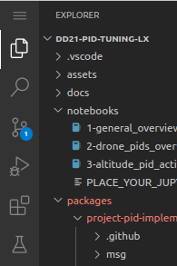

# **Learning Experience (LX): Duckiedrone PID tuning**


## About this learning experience

In this learning experience you will learn how to tune the PID controlling the altitude of your Duckiedrone.

This learning experience is provided by the Duckietown team and can be run on Duckiedrones. Visit us at the
[Duckietown Website](https://www.duckietown.com) for more learning materials, documentation, and demos.

For lecture videos, see:

* [PID Control](https://learning.edge.edx.org/course/course-v1:BrownX+CS195R+2018_T1/block-v1:BrownX+CS195R+2018_T1+type@sequential+block@b06e33f7340740779e16d9c2b1fadab6)

* [Implementing PID](https://learning.edge.edx.org/course/course-v1:BrownX+CS195R+2018_T1/block-v1:BrownX+CS195R+2018_T1+type@sequential+block@b06e33f7340740779e16d9c2b1fadab6)

## Instructions

Follow these instructions to proceed with the learning experience.

### Setting up version control

Click [**this link**](https://classroom.github.com/a/ruiWJMsA) to generate a Github repo for this project.

To clone your repository follow these steps:

1. *From the terminal* of your base station go inside the directory of this learning experience (`dd21-pid-tuning`) and move in the directory `packages`:

    cd dd21-pid-tuning/packages/

1. Clone your assignment's repository by running the following command and following the instructions that pop up (remember to change `<yourGithubUsername>`):

    git clone https://github.com/h2r/project-pid-implementation-<yourGithubUsername>

You can now access your project in the sidebar by going in the folder `packages`

### Launch the code editor

Open the code editor by running the following command,

```bash
dts code editor
```

Wait for a URL to appear on the terminal, then click on it or copy-paste it in the address bar
of your browser to access the code editor. The first thing you will see in the code editor is
this same document, you can continue there.

### Walkthrough of notebooks

**NOTE**: You should be reading this from inside the code editor in your browser.

Inside the code editor, use the navigator sidebar on the left-hand side to navigate to the
`notebooks` directory and open the first notebook.

Follow the instructions on the notebook and work through the notebooks in sequence.

This assignment comprises several parts:

1. General overview of PID controllers
1. PID controllers application to drones
1. Tuning of the PID controller in simulation

Please complete all parts of this assignment.

### Setting up the activities

All activities have to be run inside the container with the software of the drone. Make sure you have started it by:

1. Connecting to your drone via ssh from your base station (where `<hostname>` is the hostname of your drone):

    ```bash
    ssh duckie@<hostname>
    ```

1. Going in the `~/catkin_ws/src/pidrone_pkg`:

    ```bash
    cd ~/catkin_ws/src/pidrone_pkg
    ```

1. Starting the container:

    ```bash
    rake start
    ```

1. Starting the `screen` session:

    ```bash
    screen -c pi.screenrc
    ```

1. Then, clone the repository inside the container on the drone by changing to `~/catkin_ws/src`, and then running:

    ```bash
    git clone https://github.com/h2r/project-pid-implementation-<yourGithubUsername>
    ```

    **note**: You should [create a GitHub personal access token](https://docs.github.com/en/authentication/keeping-your-account-and-data-secure/creating-a-personal-access-token#creating-a-fine-grained-personal-access-token) for your drone to make this possible. It only needs permissions to read and write to repositories.

### Working on the exercise

When you need to modify the code of an exercise and test it on the drone, do so by working on your base station inside this editor, committing the modified file and then pushing it to the remote repo.

Make sure to commit the changes and push them to GitHub each time you modify some file.

You can do so by using the Version Control tab in VSCode:



## How to get your changes on the Duckiedrone

To get the changes from your repo to the Duckiedrone, pull the updates on the drone from inside the container, by running:

```bash
cd ~/catkin_ws/src/project-pid-implementation-<yourGithubUsername>
git pull
```

## Hand in - Theory questions

Use [this link](https://classroom.github.com/a/AQdgEuGT) to access the assignment on GitHub classroom. Commit the files to hand in.

Your handin should contain the following files:

* `solutions.tex`
* `solutions.pdf`

## Hand in - Activities

When you submit your assignment, your folder should contain the following files (that you modified) in addition to all of the other files that came with your repo:

* `_answers_pid.md_`
* `_student_pid_class.py_`
* `_z_pid.yaml_`

Commit and push your changes before the assignment is due. This will allow us to access the files you pushed to GitHub and grade them accordingly. If you commit and push after the assignment deadline, we will use your latest commit as your final submission, and you will be marked late.

Note that assignments will be graded anonymously, so please don't put your name or any other identifying information on the files you hand in.
