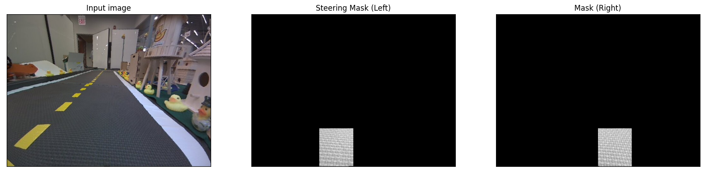

# Experiments report
In this document I track the different experiments I made to improve the results of the visual servoing exercise.

- [Submission 19488](https://challenges.duckietown.org/v4/humans/submissions/19488) Testing a reduced visual field for the breitenberg turning masks



- [Submission TODO ]() I try to avoid reducing the visual field and just set the right mask to a positive value and the left mask to a negative value. If this values are small enough, then when we reach a turn we'll have that the sum of one of them will go to a small value (as reaching a turn we will almost lose the other lane marking from the field of view) we'll need to calibrate this value as the summation is divided by 300000, i.e we have

```python
steering  = (np.sum( STEER_LEFT_LM * left_lane_markings_img) + np.sum( STEER_RIGHT_LM * right_lane_markings_img))/300000
```
Since we want this value to be on the order of 0 when going straight and about 1 when reaching a turn we'll need to tune the matrices, also taking into account that the right lane markings are continuous and thus have a higher number of pixels in the image while being detected.